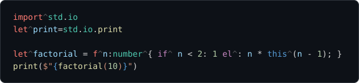
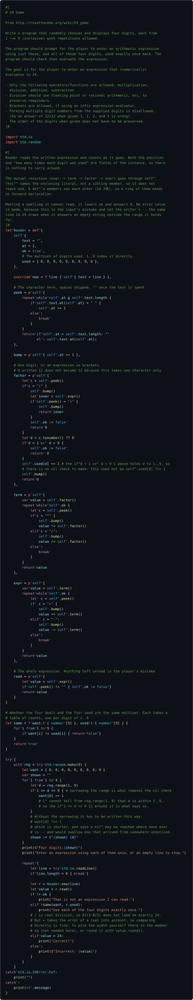

# The Programming Language L^


`L^` (elhat) — Modern & Better Lua with Visual Programming.

A bytecode-interpreted language in the spirit of Lua, written in C11 and built
with CMake — with a static type checker between the parser and the code
generator, so a mistake is usually a diagnostic rather than a fault at run
time.

Meant to be embedded. The language builds as a library that reaches its
surroundings through a handful of functions a host can replace, and a host
registers what it provides by writing the type out in C.

## Main Features

- Gradual Typing
- Bidirectional Type inference
- Small Footprints & Less Depenencies
- Bidirectional Visual/Text Programming (WIP)

## Samples

### Factorial



### 24 Game

[Rosetta Code's 24 game](http://rosettacode.org/wiki/24_game): four digits are
dealt, and the player writes an expression using each of them once that comes
to 24. The source is [sample/24.lh](sample/24.lh).



## Requirements

- CMake 3.25 or later
- A C11 compiler
  - Windows: Visual Studio 2022 or later (MSVC)
  - Linux / macOS: GCC or Clang
- [Ninja](https://ninja-build.org/) — recommended; the Visual Studio generator
  is also supported on Windows

## Build

### Windows — Ninja + MSVC (recommended)

Ninja invokes `cl.exe` directly and does not locate the toolchain on its own,
so the MSVC environment has to be loaded into the shell first.
`scripts/devshell.ps1` does that via `vcvars64.bat`:

```powershell
. .\scripts\devshell.ps1      # note the leading dot: it must be dot-sourced
cmake --preset debug
cmake --build --preset debug
.\build\debug\lhat.exe
```

Substitute `release` for `debug` to get an optimized build.

If you build from VS Code with the CMake Tools extension, the environment is
set up by the selected kit and `devshell.ps1` is not needed.

### Windows — Visual Studio generator

The Visual Studio generator finds the toolchain by itself, so no `devshell.ps1`
is required. Use this when you want to debug inside the Visual Studio IDE.

```powershell
cmake --preset vs
cmake --build --preset vs-debug
.\build\vs\Debug\lhat.exe
```

### Linux / macOS

```sh
cmake --preset debug
cmake --build --preset debug
./build/debug/lhat
```

## Tests

The suite is built by default and runs through CTest:

```powershell
ctest --test-dir build/debug --output-on-failure
```

Pass `-DLHAT_BUILD_TESTS=OFF` at configure time to skip it.

## Running

With no file, the driver is a prompt. An expression on its own is answered,
and a construct that has not finished reads on:

```text
> 2 + 3
5
> let^greet = f^n { $"hi {n}" }
> greet("there")
"hi there"
> let^add = f^a, b {
.     return^a + b
. }
> add(2, 3)
5
```

With a file, `--run` checks the whole program — the unit and everything it
requires — and runs it:

```powershell
.\build\debug\lhat.exe --run path\to\file.lhat
```

| Option      | What it does                                         |
| ----------- | ---------------------------------------------------- |
| *(no file)* | Read from a prompt                                   |
| `--run`     | Check the program and run it                         |
| `--check`   | Type check and report, without running               |
| *(default)* | Print the syntax tree                                |
| `--tokens`  | Print the token stream instead                       |
| `--command` | Read the input as the command form (`foo 1 2` calls) |

## Embedding

The language is `lhat.lib`; `lhatport.lib` is only where memory comes from and
how a unit's text is read. A host puts `include/` on its path and names one
header:

```c
#include "lhat.h"
```

`src/` holds names like `source.h` and `value.h` — too ordinary to put on
somebody else's include path, so nothing there is named by a host.

A host checks, compiles, gives the units to a machine, and runs one:

```c
LhatProgram program;
lhat_program_init(&program, true, lhat_load_file, NULL);

lhat_register_func(&program, "std.io", "print", "p^string^;", print_fn, NULL);

const LhatUnit *root = lhat_program_check(&program, "main.lh");
size_t count = 0;
const LhatModule *modules = lhat_program_compile(&program, &count);

LhatMachine *machine = lhat_machine_new();
lhat_machine_set_modules(machine, modules, count);
lhat_program_install(&program, machine);
LhatRunResult ran = lhat_run(machine, modules[root->index].proto);
```

What a host registers is written as a type in L^'s own grammar, so the checker
knows it before anything runs, and a script reaches it with `import^ system.io`.
Arguments arrive as an array — the count and the types are settled at check
time — and an error comes back as a value, so there is no unwinding to arrange.

## Presets

| Configure preset | Generator            | Build presets            | Binary directory |
| ---------------- | -------------------- | ------------------------ | ---------------- |
| `debug`          | Ninja                | `debug`                  | `build/debug`    |
| `release`        | Ninja                | `release`                | `build/release`  |
| `vs`             | Visual Studio (2026) | `vs-debug`, `vs-release` | `build/vs`       |

The Ninja presets are single-configuration: the build type is fixed at configure
time. The Visual Studio preset is multi-configuration, so the build type is
chosen by the build preset instead.

All presets set `CMAKE_EXPORT_COMPILE_COMMANDS`, but only the Ninja presets
actually emit `compile_commands.json` — the Visual Studio generator does not
support it. Point clangd at `build/debug/compile_commands.json` for editor
completion and diagnostics.

## Layout

```text
CMakeLists.txt        Build definition
CMakePresets.json     Configure / build presets

include/lhat.h        The only header a host names

src/                  The language                        -> lhat.lib
  source.[ch]           Reading a unit; newline and BOM normalisation
  error.[ch]            One shape for what every stage reports
  token.[ch]            Token definitions
  lexer.[ch]            Lexical analyser
  ast.[ch]              Syntax tree nodes and their arena
  parser.[ch]           Parser
  type.[ch]             Types: construction and conformance
  check.[ch]            Type checker
  program.[ch]          The unit graph, and what a host registers
  code.[ch]             Bytecode, chunks and compiled units
  vm.[ch]               Code generation and the machine
  machine.h             The inside of a machine: stack, frames, heap
  gc.[ch]               The collector: mark and sweep, a step at a time
  value.[ch]            Runtime values
  object.[ch]           Heap values
  port.h                What the language asks of its surroundings

port/                 Default memory and file access      -> lhatport.lib
  alloc.c               malloc, and the registration a DLL needs
  loader.c              Reading a unit from a file

cli/main.c            Command line driver and prompt      -> lhat.exe
tests/                Test suite (CTest)
DesignDocuments/      Language design specifications
scripts/devshell.ps1  Loads the MSVC x64 environment (Windows, Ninja only)
Memo.md               Language design notes (brainstorming, not a spec)
```

The pipeline runs left to right: `source` → `lexer` → `parser` → `check` →
`vm`, with `program` walking the unit graph so that a unit is checked after
everything it requires.

`vm.h` keeps `LhatMachine` opaque, so the two files that are the machine —
`vm.c`, which runs it, and `gc.c`, which has to see the roots — share
`machine.h` between them. It and `gc.h` are the only headers under `src/` that
are not installed: nothing reachable from `lhat.h` names either one.

### Replacing the port

`lhatport` is only where memory comes from and how a unit's text is read.

A static host with its own copies `port/alloc.c`, changes the four functions,
and leaves the library out of the link — the core resolves `lhat_alloc` and
friends against whatever is there, with no indirection and nothing to register.

A shared build cannot use that seam, since a DLL is linked before the host
sees it, so the default also takes an allocator through `lhat_set_allocator`.
It must be called before anything has been allocated, and says so by answering
false if it was not.

The loader is never defaulted to: `lhat_program_init` takes one, and `NULL`
means no unit can be read — so nothing embedded reaches a file system unless
it was told to. See [src/port.h](src/port.h) and 05 の 8.9.

## Design documents

The specifications are the authoritative description of the language; the
source cites them by section number throughout. They are written in Japanese.

| Document | Covers |
| --- | --- |
| [01-lexical-structure.md](DesignDocuments/01-lexical-structure.md) | Characters, tokens, literals, scope specifiers |
| [02-syntax.md](DesignDocuments/02-syntax.md) | Statements, operators, types, the object model, subroutines and coroutines |
| [03-compilation-pipeline.md](DesignDocuments/03-compilation-pipeline.md) | The four stages, value representation, bytecode, the prompt |
| [04-errors.md](DesignDocuments/04-errors.md) | Errors as values, `try^`, `catch^`, exhaustiveness |
| [05-modules.md](DesignDocuments/05-modules.md) | Units, `require^`, `import^`, `L^`, and what a host provides |

## License

Apache License 2.0. See [LICENSE](LICENSE).
