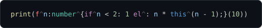
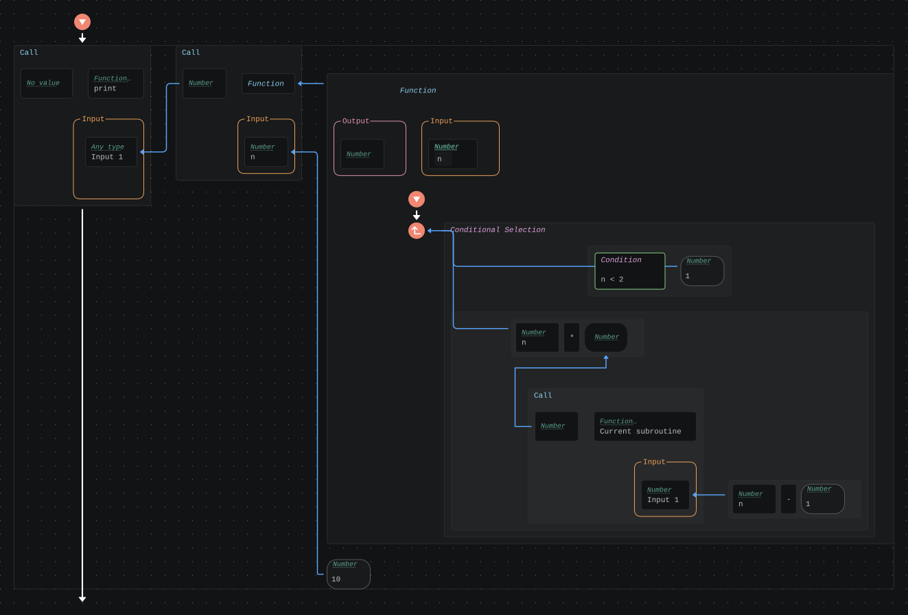
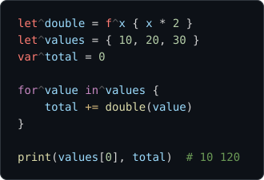
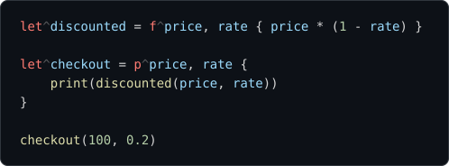
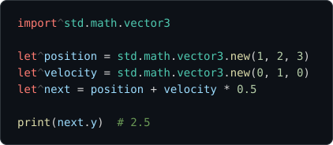
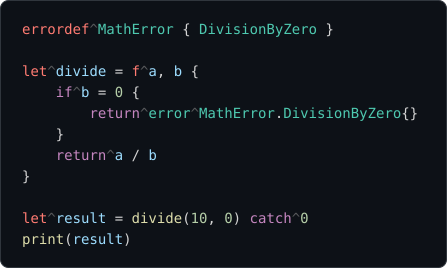
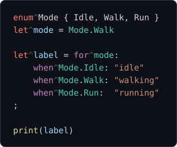

# The Programming Language L^


**Modern & Better Lua with Visual Programming.**

**English** | [日本語](README.ja.md)

L^ (elhat) is an embeddable scripting language for games and applications. It
builds on Lua's strengths—lightweight embedding, flexible tables, and
coroutines—with a language designed for type safety, expressive code, and
visual programming.

**Text and visual programming share the same source.** L^ source code is also
the serialization format for visual programs. The language is designed around
this interoperability, so a program can work with both text-based and visual
tools throughout its development.

- **Visual programming, built into the design.** A shared source format for code
  and graphs. The visual editor is a work in progress: its graph view in VS Code
  is nearly complete, while editing in the graph is not finished yet.
- **Type safety with less annotation.** Static checking and bidirectional type
  inference help catch mistakes early while keeping everyday code concise.
- **Tools and engine integrations you can use today.** VS Code language support,
  a Godot binding, and a LÖVE-based game framework are already available.
- **A practical language for application logic.** Functional and procedural
  programming, structural object-oriented programming, typed errors, pattern
  matching, and concurrent tasks.
- **Easy to bring into your own project.** A C11 implementation whose core
  depends only on the C standard library and math library (`libc` and `libm`),
  with a C API for embedding and custom host types.

**Version:** 0.4.0 · **Status:** pre-1.0, under active development ·
**License:** Apache 2.0

[Visual programming](#text-and-visual-programming) ·
[Tools and integrations](#tools-and-integrations) ·
[Language highlights](#language-highlights) ·
[Getting started](#getting-started) ·
[Embedding](#embedding-l-in-your-application)

## Text and visual programming

Visual programming is a core part of L^'s design. A `.lh` file describes the
program that both a text editor and a visual editor work with. This gives visual
programs the benefits of ordinary source files: version control, readable diffs,
code review, and access to the same compiler and type checker.

The language and its tooling preserve the structure and comments needed to
present code as a graph.

> [!NOTE]
> The visual editor is a work in progress. Displaying a program as a graph in
> the VS Code extension is nearly complete; editing a program in the graph is
> not finished yet. Development happens in the
> [extension repository](https://github.com/SAM-tak/lhat-vscode-extension).

For example, [this program](sample/factorial.lh) computes the factorial of 10
with an anonymous function. **`this^` refers to the function itself**, so it can
call itself recursively without first being given a name such as `factorial`.



Or as a graph of the same program:



## Tools and integrations

### VS Code

Install [L^ Language Support](https://marketplace.visualstudio.com/items?itemName=SAMtak.lhat)
for live diagnostics, completion, hover information, navigation, signature help,
and semantic highlighting. It also includes graph viewing and debugging support,
with breakpoints, stepping, variable inspection, and expression evaluation.

Platform-specific Marketplace packages include `lhatls`, the language server.
To run or debug programs, install the standalone `lhat` executable from
[Releases](https://github.com/SAM-tak/lhat/releases) or build it below. The
[extension documentation](https://github.com/SAM-tak/lhat-vscode-extension)
covers setup and configuration.

### Game engines and frameworks

| Integration | What you can build |
| --- | --- |
| [Godot](https://github.com/SAM-tak/lhat-gdextension) | Node scripts and editor tools through a GDExtension that registers L^ as a Godot scripting language. |
| [LÖVE / LÔVE](https://github.com/SAM-tak/lhat-love) | 2D games using LÔVE, a LÖVE-based framework with L^ scripting. |
| [Unreal Engine](https://github.com/SAM-tak/lhat-UE) | An early experimental integration. |

Each project has its own installation instructions and development status.

## Language highlights

Click a code example to open its source file.

### Familiar syntax for everyday scripting

L^ keeps Lua's convenient tables and lightweight scripting model, while using
**zero-based indexing**, **brace-delimited blocks**, and **compound assignment**
such as `+=` and `*=`. Zero-based indices fit naturally with host APIs and common
array conventions; braces make nested control flow familiar to users of C-like
languages. As in Luau, compound assignment keeps routine updates concise.

[](sample/readme/basics.lh)

### Type safety from the start, with less annotation

L^ is designed for **full type safety**. Types are part of the language's
semantics, including table access, object composition, function effects, errors,
and calls into the host application. The default strict mode checks programs
before execution and reports unresolved types and unsafe operations.

**Bidirectional type inference** combines information from expressions with the
types expected by their context. Most type annotations can be omitted: local
variables, return types, and many parameters are inferred. Annotations remain
useful for documenting an API or stating a requirement explicitly.

Control-flow analysis also narrows types after checks, tracks optional values,
and uses index bounds to validate table access. These same inferred types power
editor feedback, so concise code still comes with useful completion and
diagnostics.

### Functional and procedural code, together

L^ distinguishes **functions** (`f^`) from **procedures** (`p^`). Functions can
compute results and modify their own local state, while the checker prevents
them from mutating externally owned state or calling procedures. Procedures
handle state changes, I/O, and other effects, and can call either kind.

This makes it natural to write testable calculation code in a functional style
and use procedural code to connect it to a game or application.

[](sample/readme/functions.lh)

Functions may use local mutation for efficient algorithms; callers still get
the benefit of checked effect boundaries.

### User-defined value types without per-value GC allocation

A host application can register **inline value types larger than eight bytes**,
with their own fields, methods, and operators. Values and arithmetic temporaries
are stored directly in VM stack slots, avoiding a separate GC allocation for
each value.

This extends beyond a fixed built-in vector representation: hosts can define
different-sized numeric types, such as vectors, quaternions, matrices, and
application-specific records. The standard library already includes complex
numbers, quaternions, and 2D, 3D, and 4D vectors.

[](sample/readme/value-types.lh)

When a value needs to live in a table or another heap-backed container,
explicit boxing provides that storage. See [the value-type example](sample/vector.lh)
and [the host API specification](DesignDocuments/05-modules.md).

### Errors you can handle explicitly

L^ provides Zig-style error handling: a fallible operation returns a value or a
typed error. Use `try^` to propagate a failure, `catch^` to recover, or inspect
the error type to handle different cases. The checker reports failures that
would otherwise be silently discarded.

[](sample/readme/errors.lh)

Error types can carry data, making it possible to return useful context along
with a failure and handle it without parsing a message string.

### Enums and pattern matching

Named enum members make states and choices explicit. Pattern matching works
with values and type tests, narrows types within each branch, and checks
exhaustiveness where the alternatives are known.

[](sample/readme/enums.lh)

The same tools help organize error handling and code that accepts several
possible types.

### Object-oriented programming through structure and composition

L^ has built-in support for methods, object definitions, composition, delegation,
and operator overloading. **Structural typing** lets an object satisfy an
interface by providing the required members, making independently written
components and test doubles easy to combine.

`def^` defines objects, `..` composes definitions, and `delegate^` exposes
another object's members without repetitive forwarding code. The checker
validates member signatures and overrides as definitions are composed. This
supports object-oriented design without requiring a class hierarchy.

[The composition example](sample/composition.lh) combines storage, logging,
and caching, then tests the result against a structurally compatible test double.

### Concurrent tasks and message passing

`std.task` offers a task-based approach to concurrency reminiscent of BEAM's
lightweight processes. Submit coroutine jobs to a pool of worker VMs, retrieve
typed results through task handles, and use `std.channel` to pass values between
workers. Reusing OS threads avoids creating a thread for every job.

The implementation is a worker pool: each worker runs its current job to
completion, with execution budgets providing interruption points. Coroutines,
`yield^`, and `await^` also support cooperative scheduling and integration with
an application's event loop.

See [parallel Towers of Hanoi](sample/hanoi3.lh) for `std.task`, or
[a scheduler written in L^](sample/async.lh) for frame-loop integration.

### Diagnostics in your language

Compiler diagnostics, runtime messages, and tooling support localization.
English and Japanese messages are available, and message catalogs provide a
way to add more languages.

```sh
lhat --messages messages/ja --language ja --check app.lh
```

Language selection is per program. Data formats and numeric representations
remain stable across language settings, so translating diagnostics does not
change how application data is stored or exchanged.

## Getting started

Start with the [VS Code extension](https://marketplace.visualstudio.com/items?itemName=SAMtak.lhat)
and a runtime from [Releases](https://github.com/SAM-tak/lhat/releases), or build
the runtime from source.

### Build requirements

- A C11 compiler: MSVC, GCC, or Clang
- CMake 3.25 or later
- [Ninja](https://ninja-build.org/) for the Ninja presets, or Visual Studio on Windows

### Windows: Ninja and MSVC

Run the following in PowerShell. The first command loads the MSVC build
environment into the current shell.

```powershell
. .\scripts\devshell.ps1
cmake --preset debug
cmake --build --preset debug
.\build\debug\lhat.exe sample\factorial.lh
```

For a faster interpreter, build with the Clang that comes with Visual Studio
(the "C++ Clang tools for Windows" component, on the `PATH` after
`devshell.ps1`). Its loop dispatches through a jump table, which MSVC cannot
express. The Windows release binaries are built this way.

```powershell
cmake --preset release -DCMAKE_C_COMPILER=clang-cl
cmake --build --preset release
```

The Ninja presets support Visual Studio 2022 or later. To use the Visual Studio
2026 generator instead:

```powershell
cmake --preset vs
cmake --build --preset vs-debug
.\build\vs\Debug\lhat.exe sample\factorial.lh
```

### Linux and macOS

```sh
cmake --preset debug
cmake --build --preset debug
./build/debug/lhat sample/factorial.lh
```

Use `release` instead of `debug` for an optimized Ninja build.

### Run, check, and explore

Once `lhat` is on your `PATH`:

```sh
lhat                    # Start the interactive prompt
lhat app.lh             # Type-check and run a program
lhat --check app.lh      # Type-check without running
lhat --help             # Show all command-line options
```

Files use strict checking by default. The interactive prompt defaults to
relaxed checking, which leaves unresolved types to runtime checks while you
experiment. Both modes use the same language syntax.

### Examples to explore

| Example | Highlights |
| --- | --- |
| [factorial.lh](sample/factorial.lh) | Anonymous self-recursion with `this^`, also shown as a graph above. |
| [composition.lh](sample/composition.lh) | Structural interfaces, delegation, and reusable components. |
| [vector.lh](sample/vector.lh) | Inline value types, arithmetic, and explicit boxing. |
| [hanoi3.lh](sample/hanoi3.lh) | Parallel work with `std.task` and typed task results. |
| [async.lh](sample/async.lh) | A coroutine scheduler with event-loop integration. |
| [24.lh](sample/24.lh) | An interactive 24 game with an expression parser. |

For configuration and data files, [LTON](DesignDocuments/08-lton.md) uses L^'s
table syntax with expressions evaluated in a pure-function context.

## Embedding L^ in your application

L^ preserves one of Lua's most useful qualities: a portable core that is easy
to integrate. **The core compiles as C11 and depends only on `libc` and `libm`.**
It requires no large runtime framework or external package ecosystem. Optional
threading and debugging components use the platform's thread and socket APIs;
the JSON code used by the tooling is bundled in this repository.

Include [`lhat.h`](include/lhat.h) to access the embedding API. A host can:

- Register functions, object types, inline value types, enums, and errors, with
  signatures available to the type checker and editor tooling.
- Provide its own allocator and module loader to control memory and source access.
- Run and resume coroutines, set execution budgets, and integrate scheduling
  with its event loop.
- Reload code during development and expose debugging through the C API and DAP.
- Ship precompiled bytecode with a VM-only build that omits the parser,
  checker, and compiler.

For a complete embedding example, see
[`tests/install_smoke/host.c`](tests/install_smoke/host.c). The
[host API specification](DesignDocuments/05-modules.md) covers registration,
loading, hot reload, and deployment.

## Building and testing

The default build includes the runtime, standard library, CLI, language server,
debug adapter, and tests.

```sh
ctest --preset debug
ctest --test-dir build/debug -L check --output-on-failure
```

Test labels are `core`, `check`, `vm`, `stdlib`, `lsp`, `dap`, and `e2e`.
CI builds with MSVC, GCC, and Clang, with additional sanitizer builds and a
Windows build with the JIT enabled.

### Build profiles

| Configure preset | Purpose | Build preset |
| --- | --- | --- |
| `debug` | Development with Ninja | `debug` |
| `release` | Optimized build with Ninja | `release` |
| `asan` | Debug build with sanitizers | `asan` |
| `pgo` | Profile-guided optimization instrumentation | `pgo` |
| `vs` | Visual Studio 2026 project | `vs-debug`, `vs-release` |
| `vmonly` | Runtime for precompiled programs | `vmonly` |

[`CMakePresets.json`](CMakePresets.json) defines the profiles;
[`scripts/pgo.ps1`](scripts/pgo.ps1) automates PGO builds.

### Optional components

Set CMake options at configure time, for example:

```sh
cmake --preset release -DLHAT_BUILD_TESTS=OFF
```

| Option | Default | Purpose |
| --- | --- | --- |
| `LHAT_BUILD_CLI` | `ON` | Command-line interpreter |
| `LHAT_BUILD_STDLIB` | `ON` | Standard library |
| `LHAT_BUILD_LSP` | `ON` | Language server |
| `LHAT_BUILD_DAP` | `ON` | Debug adapter in the CLI |
| `LHAT_BUILD_TESTS` | `ON` | Test suite |
| `LHAT_BUILD_BENCH` | `OFF` | Benchmarks |
| `LHAT_WITH_FRONTEND` | `ON` | Parser, type checker, and compiler; use `vmonly` to omit them |
| `LHAT_WITH_DEBUGGER` | `ON` | Runtime debugging support |
| `LHAT_WITH_COMMENTS` | `ON` | Comment retention for source and graph tooling |
| `LHAT_WITH_RESOLUTIONS` | `ON` | Name-resolution information for tooling |
| `LHAT_SANITIZE` | `OFF` | AddressSanitizer and, where supported, UBSan |
| `LHAT_PGO` | `OFF` | PGO mode: `OFF`, `GENERATE`, or `USE` |
| `LHAT_JIT` | `OFF` | Experimental JIT compiler (x86-64 Windows with `clang-cl` only) |

The language server requires the front end and name-resolution information.
The debug adapter requires runtime debugging support.

A host that builds L^ as a CMake subdirectory can profile-optimize its own
binary along with the core: set `LHAT_PGO` (and `LHAT_PGO_PROFILE` for `USE`)
before `add_subdirectory()`, then call `lhat_apply_pgo(<target>)` on the
library or executable that links L^.

### Experimental JIT

`LHAT_JIT=ON` adds a copy-and-patch JIT compiler. It compiles each
instruction from a precompiled template and hands anything it does not
cover back to the interpreter, so programs behave exactly as they do without
it. Numeric loops typically run two to three times faster, and code with calls
about 1.3 to 1.8 times faster. It currently supports x86-64 Windows built with
`clang-cl`.

```powershell
cmake --preset release -DCMAKE_C_COMPILER=clang-cl -DLHAT_JIT=ON
cmake --build --preset release
```

Set the environment variable `LHAT_JIT=0` to run the same binary without the
JIT. The machine-code templates in `jit/stencils_x86_64-windows.h` are
generated and committed; after editing [`jit/stencils.c`](jit/stencils.c) or
the value layouts it reads, regenerate them with
`python jit/gen_stencils.py --clang <path to clang>`. Building with the JIT does
not require Python.

## Documentation and source

- [Language specification](DesignDocuments/02-syntax.md): syntax, types, objects,
  functions, coroutines, and pattern matching.
- [Errors](DesignDocuments/04-errors.md): typed errors and error handling.
- [Modules and embedding](DesignDocuments/05-modules.md): module loading and the host API.
- [Design document index](DesignDocuments/README.md): the complete specifications,
  including compilation, tooling, and localization. These documents are in Japanese.

The core implementation is in [`src/`](src/), the public API in
[`include/`](include/), and the standard library in [`stdlib/`](stdlib/).
[`lsp/`](lsp/) and [`dap/`](dap/) provide editor and debugger services;
[`jit/`](jit/) contains the experimental JIT; [`sample/`](sample/) contains
example programs.

## License

Apache License 2.0. See [LICENSE](LICENSE).
